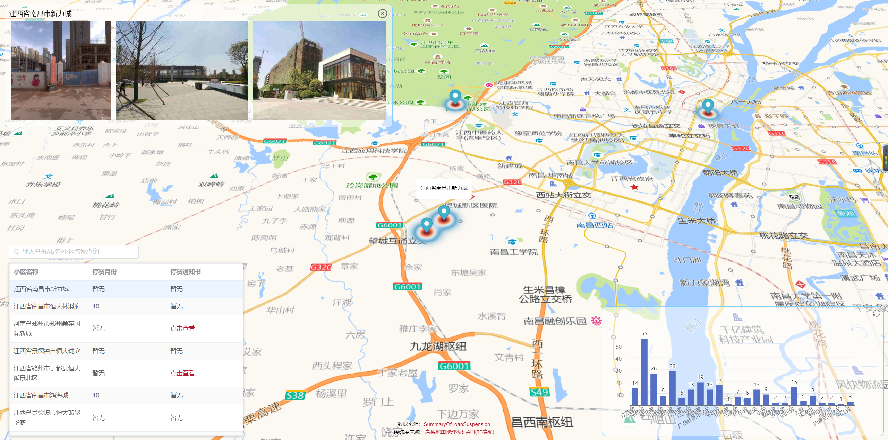

# WeNeedHome

[数据源：SummaryOfLoanSuspension](https://github.com/WeNeedHome/SummaryOfLoanSuspension)

[地图源：高德地图](https://wprd04.is.autonavi.com)

[经纬度来源：高德地图地理编码API(非精确)](https://lbs.amap.com/api/webservice/guide/api/georegeo)

[修改地图数据经纬度](https://github.com/aiheihe/WeNeedHome/blob/main/datas/mapDatas.js)

```javascript
     name: 城市名称+小区名称
     link?: 停贷通知书
     month?: 停贷月份
     lng: 经度
     lat: 纬度
     geocode?: 冗余数据,为空就行
```
[修改柱状图数据](https://github.com/aiheihe/WeNeedHome/blob/main/datas/echartsDatas.js)
```javascript
     name: 城市名称/小区名称
     link?: 停贷通知书
     month?: 停贷月份
     children?: 子级城市
     conut?: 数量（省级行政区）
```

    谨以此项目，进行全国各省市烂尾楼停贷通知汇总地图可视化统计。
    希望政府早日给出国内烂尾楼解决方案，给广大烂尾楼业主一个完整的家。
    


    
    

